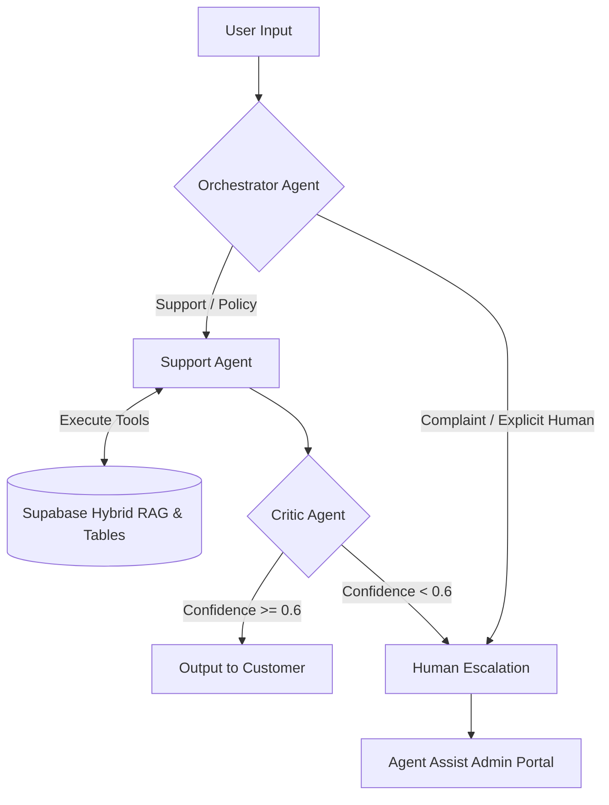

# 🚀 TechNova CX

[](https://nextjs.org/)
[](https://www.typescriptlang.org/)
[](https://supabase.com/)
[](https://ai.google.dev/)
[](https://tailwindcss.com/)

**An Enterprise-Grade, Air-Gapped AI Customer Experience Platform with Multi-Agent Guardrails & Human-in-the-Loop Escalation.**

## 💡 The Problem vs. Our Solution

**Traditional customer support chatbots** rely on simple prompt wrappers that frequently hallucinate policies, trap users in frustrating automated loops, and lack transparency for support teams.

**Our Solution:** TechNova CX uses a **self-correcting, 3-agent AI architecture** grounded in a live Supabase vector database. It verifies every factual claim before showing it to the customer and seamlessly escalates complex or sensitive issues to human agents—complete with pre-drafted AI solutions.

## ✨ Key Features

- **Multi-Agent Pipeline:** Orchestrator (Intent), Support (Tool Execution), and Critic (Hallucination Guardrail) working seamlessly to resolve queries.
- **Hybrid RAG:** Combining `pgvector` semantic search with PostgreSQL `tsvector` keyword search using Reciprocal Rank Fusion (RRF) for pinpoint knowledge retrieval.
- **Live Trace Observability:** A transparent `⚡ View AI Trace` drawer allowing customers and admins to see real-time agent reasoning, executed tools, and Critic verification scores.
- **Agent Assist Portal:** An OLED dark-themed admin dashboard (`/admin/tickets`) where human managers receive escalated tickets with full conversation history and AI-drafted responses ready for one-click approval.
- **End-to-End Citation Linking:** Public trust center (`/policies`) deep-links directly from chat citation chips.

## 🧠 Core Architecture



## 🛠️ Getting Started & Local Setup

**1. Clone the repository**
```bash
git clone https://github.com/your-username/technova-cx.git
cd technova-cx
```

**2. Install dependencies**
```bash
npm install
```

**3. Configure Environment Variables**
Create a `.env.local` file in the root directory:
```env
NEXT_PUBLIC_SUPABASE_URL=your_supabase_project_url
SUPABASE_SERVICE_ROLE_KEY=your_supabase_service_role_key
GEMINI_API_KEY=your_google_gemini_api_key
```

**4. Initialize Database**
Run the Supabase migrations and seed scripts to populate the vector database and product tables.
```bash
# Using Supabase CLI
supabase start
supabase db reset
```

**5. Start the Development Server**
```bash
npm run dev
```
Navigate to `http://localhost:3000` to interact with the TechNova CX storefront.

## 🎯 Hackathon Demo Walkthrough Guide

Evaluators can test our core features using the provided **Quick Reply pills** on the `/support` page:

1. **Test Tool Execution (Order Tracking):** Click `📦 Where is order ORD-7734?` to see the Support Agent fetch live order status from the Postgres table.
2. **Test Grounded RAG & Citations (Warranty):** Click `🛡️ Is NovaBook Pro X15 under warranty?` to see the Support Agent retrieve context, and click the generated citation chip to deep-link directly to the `/policies` trust center.
3. **Test the Critic Agent Trace:** After any AI response, click the `⚡ View AI Trace` drawer to inspect the Orchestrator's intent classification, the Support Agent's tool calls, and the Critic Agent's verification score.
4. **Test Human-in-the-Loop Escalation:** Click `⚠️ I need to speak to a human manager.` The Critic or Orchestrator will instantly escalate. Navigate to `/admin/tickets` to see the escalated ticket in the Agent Assist Portal.
