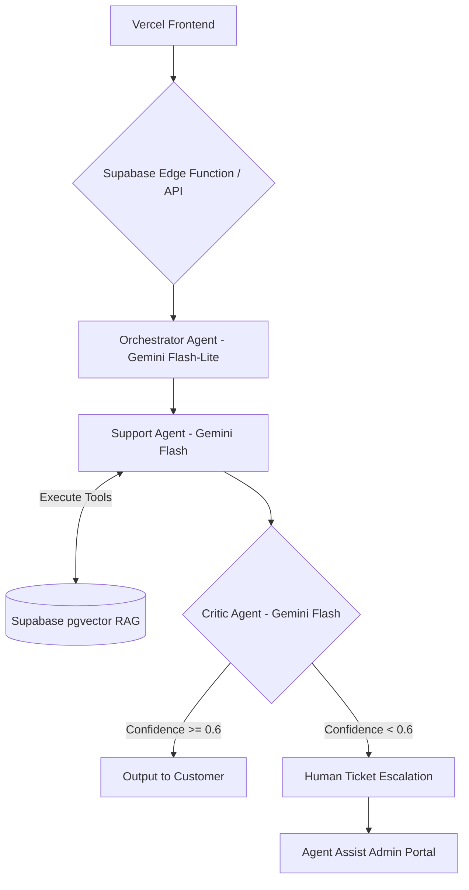

# TechNova CX — An Enterprise-Grade, Air-Gapped AI Customer Experience Platform with Multi-Agent Guardrails & Human-in-the-Loop Escalation.

[](https://nextjs.org/)
[](https://www.typescriptlang.org/)
[](https://supabase.com/)
[](https://ai.google.dev/)
[](https://tailwindcss.com/)

## 💡 The Problem vs. Our Solution

**Traditional customer support chatbots** rely on generic, single-prompt architectures that frequently hallucinate company policies, trap users in frustrating automated loops, and offer zero transparency for human support teams.

**Our Solution:** TechNova CX replaces generic chatbots with a **self-correcting, 3-agent AI pipeline**. It verifies every factual claim before communicating with the customer. The Orchestrator routes intent, the Support Agent calls live database tools, and the Critic Agent acts as a strict `0.6` confidence guardrail—seamlessly escalating complex issues to human agents with pre-drafted AI solutions.

## 🧠 Core Architecture Diagram



## 🛠️ Local Setup Instructions

**1. Clone the repository**
```bash
git clone https://github.com/your-username/technova-cx.git
cd technova-cx
```

**2. Configure Environment Variables**
Copy `.env.example` to `.env.local` and add your secure keys:
```env
GEMINI_API_KEY="your_api_key_here"
NEXT_PUBLIC_SUPABASE_URL="https://your-project.supabase.co"
NEXT_PUBLIC_SUPABASE_ANON_KEY="your_anon_key_here"
SUPABASE_SERVICE_ROLE_KEY="your_service_role_key_here"
```

**3. Install Dependencies & Initialize Database**
Install node modules and use the Supabase CLI to push the schemas and seed data:
```bash
npm install
supabase start
supabase db reset
# Or manually run supabase/migration.sql and supabase/seed.sql in your SQL editor
```

**4. Start the Development Server**
```bash
npm run dev
```
Navigate to `http://localhost:3000` to experience the TechNova CX storefront.

## 🎯 Hackathon Demo Guide

Judges and evaluators can test our complete multi-agent pipeline using the 4-step script below:

1. **Test Tool Execution (Order Tracking):** On the `/support` page, click the quick-reply pill `📦 Where is order ORD-7734?`. The Support Agent will securely fetch live order status from the Postgres table.
2. **Test Grounded RAG & Citations (Warranty):** Click `🛡️ Is NovaBook Pro X15 under warranty?`. Watch as the Support Agent retrieves context and generates a citation chip. Click the chip to deep-link directly to the exact verified text on the `/policies` trust center page.
3. **Test the Critic Agent Trace:** After any AI response, open the `⚡ View AI Trace` drawer in the chat bubble. You can actively inspect the Orchestrator's intent classification, the Support Agent's tool calls, and the Critic Agent's verification score in real-time.
4. **Test Human-in-the-Loop Escalation:** Click `⚠️ I need to speak to a human manager.`. The Critic or Orchestrator will instantly flag the hard trigger and escalate. Navigate to `/admin/tickets` to see the newly escalated ticket waiting in the Agent Assist Portal with full trace context.
